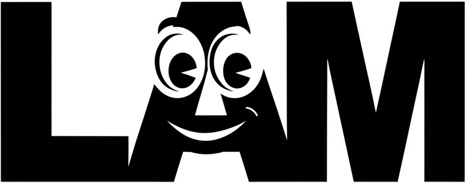
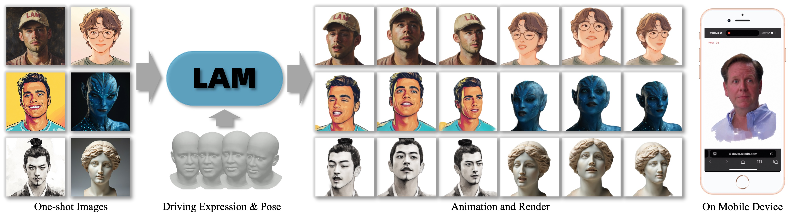

# LAM: Official Pytorch Implementation

<p align="center">
<strong>English | <a href="README_CN.md">中文</a></strong>
</p>

[](https://aigc3d.github.io/projects/LAM/) 
[](https://arxiv.org/pdf/2502.17796)
[](https://huggingface.co/spaces/3DAIGC/LAM)
[](https://www.modelscope.cn/studios/Damo_XR_Lab/LAM_Large_Avatar_Model) 
[](https://www.apache.org/licenses/LICENSE-2.0)

<p align="center">
  
</p>

### <p align="center"> LAM: Large Avatar Model for One-shot Animatable Gaussian Head </p>

#### <p align="center"> SIGGRAPH 2025 </p>

#####  <p align="center"> Yisheng He*, Xiaodong Gu*, Xiaodan Ye, Chao Xu, Zhengyi Zhao, Yuan Dong†, Weihao Yuan†, Zilong Dong, Liefeng Bo </p>

#####  <p align="center"> Tongyi Lab, Alibaba Group</p>

####  <p align="center"> **"Build 3D Interactive Chatting Avatar with One Image in Seconds!"** </p>

<p align="center">
  
</p>


## Core Highlights 🔥🔥🔥
- **Ultra-realistic 3D Avatar Creation from One Image in Seconds**
- **Super-fast Cross-platform Animating and Rendering on Any Devices**
- **Low-latency SDK for Realtime Interactive Chatting Avatar**

<div align="center">
  <video controls src="https://github.com/user-attachments/assets/98f66655-e1c1-40a9-ab58-bdd49dafedda" width="80%">
  </video>
</div>

## 📢 News

**[May 20, 2025]** We have released the [WebGL-Render](https://github.com/aigc3d/LAM_WebRender)!

**[May 10, 2025]** The [ModelScope](https://www.modelscope.cn/studios/Damo_XR_Lab/LAM_Large_Avatar_Model) Demo now supports directly exporting the generated Avatar to files required by OpenAvatarChat for interactive chatting!

**[April 30, 2025]** We have released a [Avatar Export Feature](tools/AVATAR_EXPORT_GUIDE.md) that allows users to chat with any LAM-generated 3D digital humans on OpenAvatarChat. 🔥 <br>

**[April 21, 2025]** We have released the WebGL Interactive Chatting Avatar SDK on [OpenAvatarChat](https://github.com/HumanAIGC-Engineering/OpenAvatarChat) (including LLM, ASR, TTS, Avatar), with which you can freely chat with the 3D Digital Human generated by LAM ! 🔥 <br>

**[April 19, 2025]** We have released the [Audio2Expression](https://github.com/aigc3d/LAM_Audio2Expression) model, which can animate the generated LAM Avatar with audio input ! 🔥 <br>

<!-- **[April 10, 2025]** We have released the demo on [ModelScope](https://www.modelscope.cn/studios/Damo_XR_Lab/LAM_Large_Avatar_Model) Space ! <br> -->

### To do list
- [x] Release LAM-small trained on VFHQ and Nersemble.
- [x] Release Huggingface space.
- [x] Release Modelscope space.
- [ ] Release LAM-large trained on a self-constructed large dataset.
- [x] Release WebGL Render for cross-platform animation and rendering.
- [x] Release audio driven model: Audio2Expression.
- [x] Release Interactive Chatting Avatar SDK with [OpenAvatarChat](https://github.com/HumanAIGC-Engineering/OpenAvatarChat), including LLM, ASR, TTS, Avatar.


## 🚀 Get Started

### Online Demo

Avatar Generation from One Image:

  [](https://huggingface.co/spaces/3DAIGC/LAM)
  [](https://www.modelscope.cn/studios/Damo_XR_Lab/LAM_Large_Avatar_Model) 

Interactive Chatting:

  [](https://huggingface.co/spaces/HumanAIGC-Engineering-Team/open-avatar-chat)
  [](https://www.modelscope.cn/studios/HumanAIGC-Engineering/open-avatar-chat) 


### Environment Setup

We provide a one-click installation package on Windows (Cuda 12.8), supported by "十字鱼". &nbsp; &nbsp;
[Video](https://www.bilibili.com/video/BV13QGizqEey) &nbsp; &nbsp;
[Download Link](https://virutalbuy-public.oss-cn-hangzhou.aliyuncs.com/share/aigc3d/data/LAM/Installation/LAM-windows-one-click-install.zip)


#### Linux:
```bash
git clone https://github.com/aigc3d/LAM.git
cd LAM
# Install with Cuda 12.1
sh ./scripts/install/install_cu121.sh
# Or Install with Cuda 11.8
sh ./scripts/install/install_cu118.sh
```

#### Windows:
For Windows, please refer to the [Windows Install Guide](scripts/install/WINDOWS_INSTALL.md).

### Model Weights

| Model   | Training Data                  | HuggingFace | ModelScope | Reconstruction Time | A100 (A & R) |   XiaoMi 14 Phone (A & R)          |
|---------|--------------------------------|----------|----------|---------------------|-----------------------------|-----------|
| LAM-20K | VFHQ                          | TBD       | TBD      | 1.4 s               | 562.9FPS                    | 110+FPS   |
| LAM-20K | VFHQ + NeRSemble                | [Link](https://huggingface.co/3DAIGC/LAM-20K) | [Link](https://www.modelscope.cn/models/Damo_XR_Lab/LAM-20K/summary)   | 1.4 s               | 562.9FPS                    | 110+FPS   |
| LAM-20K | Our large dataset | TBD      | TBD      | 1.4 s               | 562.9FPS                    | 110+FPS   |

(**A & R:** Animating & Rendering )

#### HuggingFace Download
```bash
# Download Assets
huggingface-cli download 3DAIGC/LAM-assets --local-dir ./tmp
tar -xf ./tmp/LAM_assets.tar && rm ./tmp/LAM_assets.tar
tar -xf ./tmp/thirdparty_models.tar && rm -r ./tmp/
# Download Model Weights
huggingface-cli download 3DAIGC/LAM-20K --local-dir ./model_zoo/lam_models/releases/lam/lam-20k/step_045500/
```

#### ModelScope Download 
```bash
pip3 install modelscope
# Download Assets
modelscope download --model "Damo_XR_Lab/LAM-assets" --local_dir "./tmp/"
tar -xf ./tmp/LAM_assets.tar && rm ./tmp/LAM_assets.tar
tar -xf ./tmp/thirdparty_models.tar && rm -r ./tmp/
# Download Model Weights
modelscope download "Damo_XR_Lab/LAM-20K" --local_dir "./model_zoo/lam_models/releases/lam/lam-20k/step_045500/"
```


### Gradio Run
```bash
python app_lam.py
```
If you want to export ZIP files for real-time conversations on OpenAvatarChat, please refer to the [Guide](tools/AVATAR_EXPORT_GUIDE.md).
```bash
python app_lam.py --blender_path /path/blender
```

### Inference
```bash
sh ./scripts/inference.sh ${CONFIG} ${MODEL_NAME} ${IMAGE_PATH_OR_FOLDER} ${MOTION_SEQ}
```

### Acknowledgement
This work is built on many amazing research works and open-source projects:
- [OpenLRM](https://github.com/3DTopia/OpenLRM)
- [GAGAvatar](https://github.com/xg-chu/GAGAvatar)
- [GaussianAvatars](https://github.com/ShenhanQian/GaussianAvatars)
- [VHAP](https://github.com/ShenhanQian/VHAP)

Thanks for their excellent works and great contribution.


### More Works
Welcome to follow our other interesting works:
- [LHM](https://github.com/aigc3d/LHM)


### Citation
```
@inproceedings{he2025LAM,
  title={LAM: Large Avatar Model for One-shot Animatable Gaussian Head},
  author={
    Yisheng He and Xiaodong Gu and Xiaodan Ye and Chao Xu and Zhengyi Zhao and Yuan Dong and Weihao Yuan and Zilong Dong and Liefeng Bo
  },
  booktitle={SIGGRAPH},
  year={2025}
}
```
